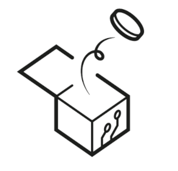
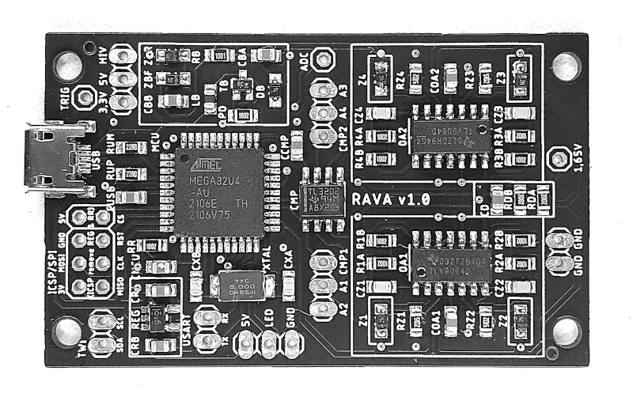
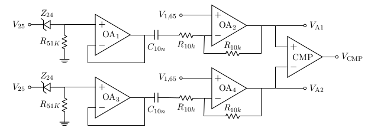
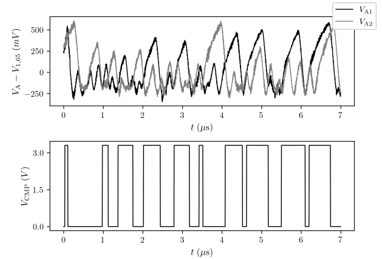

# RAVA: an Open Hardware True Random Number Generator based on Avalanche Noise

RAVA is an open source true random number generator (TRNG) designed to provide a fully transparent and customizable platform to make trusted and high-quality entropy accessible to a larger audience. The RAVA device's main characteristics are:

- High-quality entropy: producing unbiased and independent random bits that do not require any post-processing algorithm.

- Immunity of environmental conditions: the resulting entropy is related to the difference between two similar noise sources. This differential design cancels out possible influences of thermal and electromagnetic nature. 

- Dual entropy core: the circuit has two parallel and independent entropy channels that simultaneously produce random bytes. The dual design provides redundancy, a double output rate, or a unique feature for experiments that employ a condition/control design.

- Fully transparent: as an open source project, by providing the circuit design, firmware, and the user side software. At the hardware level, providing monitoring headers that can be used to inspect voltages and noise sources.

- Customizable: by providing interface headers for coupling with other circuits, sensors, or IC components. Also, the user has complete control over the device's operation by sending commands over a USB interface. Finally, as an open source project, it is possible to change the circuit behavior and implement new functionalities by updating the firmware.

- Accessible: as a discrete circuit that employs low-cost IC components that can be manually soldered to the printed circuit board. 

- NIST compliant: by providing the physical reasoning of the entropy source, implementing startup and continuous randomness health tests in its firmware, and estimating min-entropy measures (see the publication below).

The implementation is presented as a discrete circuit with an ATmega32U4 microcontroller and a USB interface, achieving an unbiased throughput of 137 Kbits/s. 

## Entropy

The physical phenomenon associated with the RAVA circuit’s entropy is the avalanche breakdown of reverse-biased diodes and the time unpredictability of those events.

A 25V voltage is applied to two reverse-biased 24V Zener diodes. Then the noise channels are buffered (OA1, OA3), DC decoupled, and raised to a common DC level with unity-gain (OA2, OA4), producing the avalanche noise analog channels VA1 and VA2.
The analog channels are compared between themselves (CMP), producing a digital output V_CMP that randomly changes its state. 

An example of VA1 and VA2 measured data can be seen above. 
The comparator produces a 3.3V output when VA1 > VA2 and 0V when VA2 > VA1, hence generating a rising edge pulse when the channel's one voltage becomes larger than channel's two. 
The pulses' unpredictability constitutes the circuit's randomness source as both VAi channels represent avalanche breakdown events at unforeseen times.

The noise source output, the V_CMP channel, is wired to a timer/counter port in the MCU configured to count the number of digital pulses arriving in the port.
Every random bit is generated by resetting the counter and counting the number of pulses after a fixed sampling period. 
It results in 0 if the pulse count is even and 1 if odd.
The example reveals ten pulses in the sampling period of 7 mus that would result in a 0 bit.

## Publication

<!-- 
For more details, including statistical tests, and a comparision with a commercial TRNG based on quantum optical phenomena, please see the [article published in XXX]() 
--> 
An article describing the circuit's details is being submitted for peer review in an electronics journal. It includes statistical tests and a comparison with a commercial TRNG based on quantum optical phenomena. More details soon.

## Documentation

- [RAVA circuit schematics](images/rng_rava_schematics.png)
- [Building your own RAVA circuit](https://github.com/gabrielguerrer/rng_rava/wiki/Building-your-own-RAVA-circuit)
- [Testing your RAVA circuit](https://github.com/gabrielguerrer/rng_rava/wiki/Testing-your-RAVA-circuit)

## Associated projects

- [RAVA firmware](https://github.com/gabrielguerrer/rng_rava_firmware)
- [RAVA python driver](https://github.com/gabrielguerrer/rng_rava_driver_py)

## Contact

gabrielguerrer [at] gmail [dot] com

