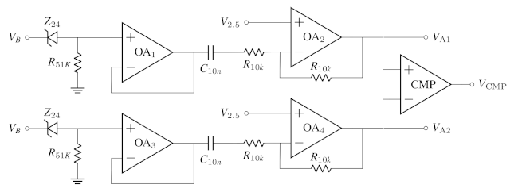
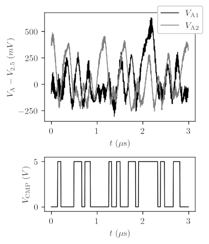
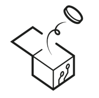

# RAVA: an Open Hardware True Random Number Generator based on Avalanche Noise

RAVA is an open-source True Random Number Generator (TRNG) designed to offer a transparent and customizable platform, making auditalbe and high-quality entropy accessible to a wider audience. 
The RAVA device's main characteristics are:

- High-quality entropy: Producing unbiased and independent random bits without a post-processing algorithm.

- Differential design: Aiming towards immunity to environmental conditions by comparing two similar and independent noise sources.

- Dual entropy core: Incorporating two parallel and independent entropy channels that simultaneously produce random bytes. The dual design provides redundancy, a double output rate, or a unique feature for experiments employing a condition/control design.

- Full transparency: As an open-source project providing complete access to the circuit design, firmware, and user-side software, including drivers, libraries, and utilities.  At the hardware level, monitoring headers allow real-time inspection of voltages and noise sources during operation.

- Customizability: Offering interface headers for integration with other circuits, sensors, and integrated circuit (IC) components. Users have full control over the device's operation by sending commands through a communication interface. Moreover, as an open-source project, the firmware can be updated to modify the circuit's behavior and implement new functionalities.

- Accessibility: As a discrete circuit employing low-cost IC components and SMD resistors and capacitors of size 0805. Ensuring that the device remains affordable and can be assembled by users through manual soldering of the components to the printed circuit board. 

The v1.0 implementation ([schematics](v1.0/rng_rava_schematics.png)) is presented as a discrete circuit with an ATmega32U4 microcontroller and a USB interface, achieving an unbiased throughput of 136.0 Kbits/s.

## Publication

For a comprehensive overview, encompassing an in-depth exploration of the noise source, a stochastic model, and statistical tests, please consult the article
- [IEEE Access, DOI: 10.1109/ACCESS.2023.3327325](https://ieeexplore.ieee.org/document/10295491)

## Entropy

The physical phenomenon associated with the RAVA circuit’s entropy is the avalanche breakdown of reverse-biased diodes and the time unpredictability of those events.

A 25.5V voltage is applied to two reverse-biased 24V Zener diodes. 
Next, the noise voltages are buffered using operational amplifiers (OA1, OA3).
The noise voltages are then DC decoupled and raised to a common level of 2.5V using unity-gain operational amplifiers (OA2, OA4). 
These operations result in the *avalanche noise* channels V_A1 and V_A2.

Finally, the analog channels V_A1 and V_A2 are connected to a comparator IC, which produces a digital output V_CMP representing which Zener produces the largest avalanche noise at a given time.
The V_CMP output, referred to as *differential noise*, consists of a sequence of pulses with varying lengths and unknown rising edge times. 
The interval between successive pulses depends on the avalanche breakdown occurring in the reverse-biased Zener diodes. 
Consequently, the pulses' intervals are inherently unpredictable, serving as an entropy source for the circuit.

Below is an example showcasing data for V_A1, V_A2, and V_CMP

The noise source output V_CMP is wired to a timer/counter port in the microcontroller configured to count the measured rising edge pulses.
Every ith-random bit is generated by evaluating the *pulse count* after a fixed *sampling interval*. 
The i-th bit results in 0 if the pulse count is even and 1 if odd.
The example reveals nine pulses in the sampling interval of 3 mus that would result in a 1 bit.

## Documentation

- [RAVA ‐ Assembling and Inspecting](https://github.com/gabrielguerrer/rng_rava/wiki/RAVA-Device-%E2%80%90-Assembling-and-Inspecting)
- [RAVA Firmware ‐ Installation](https://github.com/gabrielguerrer/rng_rava_firmware/wiki/RAVA-Firmware-%E2%80%90-Installation)
- [RAVA Firmware ‐ How it works](https://github.com/gabrielguerrer/rng_rava_firmware/wiki/RAVA-Firmware-%E2%80%90-How-it-works)
- [RAVA Python Driver - Installation and Usage](https://github.com/gabrielguerrer/rng_rava_driver_py)
- [RAVA Tools - Statistical Tests](https://github.com/gabrielguerrer/rng_rava_tools_py/wiki/Statistical-Tests)

## Associated projects

- [RAVA Firmware](https://github.com/gabrielguerrer/rng_rava_firmware)
- [RAVA Python Driver](https://github.com/gabrielguerrer/rng_rava_driver_py)
- [RAVA Python Tools](https://github.com/gabrielguerrer/rng_rava_tools_py)

## Contact

gabrielguerrer [at] gmail [dot] com

